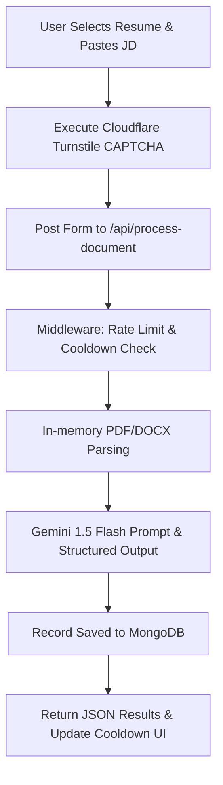

# AI-Powered ATS Resume Scorer & Analyzer

ATS Resume Scorer is a modern, no-login web application that allows job seekers to upload their resume (in PDF or DOCX format), optionally paste a Job Description (JD), and instantly receive an ATS compatibility score along with specific, structured feedback and actionable suggestions powered by Google Gemini 1.5 Flash.

The project is built on Next.js 16 (App Router), MongoDB, Nodemailer, Cloudflare Turnstile, and the Google Gen AI SDK.

---

## 🚀 Key Features

*   **Multipart Resume Parsing**: Accepts PDF and DOCX file uploads, extracting text in-memory dynamically via Mammoth and built-in buffer streams.
*   **Optional Job Description Analysis**: Evaluates resume text against an optional pasted JD (up to 5,000 characters) with a real-time character counter.
*   **ATS Compatibility Meter**: Displays an overall ATS score (0–100) using a responsive, animated circular progress gauge that changes color based on performance tiers.
*   **Keyword Extraction**: Highlights **Matched Keywords** (green badges) and **Missing Keywords** (red badges) to guide resume tailoring.
*   **Multi-Factor Score Breakdown**: Displays horizontal rating bars evaluating Keyword Match, Work Experience Quality, Resume Structure, Skills Section, Formatting & Readability, Education, and Contact Information.
*   **Interactive Feedback System**: Features an animated feedback modal that validates input via Cloudflare Turnstile CAPTCHA, persists responses to MongoDB, and emails the site owner via Nodemailer.
*   **Abuse Prevention**: Implements a sliding-window rate-limiter alongside a rolling 3-hour IP usage counter (up to 5 analyses per window) to secure API keys and optimize usage costs.

---

## 🛠️ Tech Stack & System Architecture

| Layer | Technology | Purpose |
| :--- | :--- | :--- |
| **Frontend** | React 19 + Next.js 16 (App Router) + Tailwind CSS v4 | Interactive UI, status overlays, responsive layouts |
| **Backend** | Next.js API Routes (Node.js runtime) | API server, document parsing, Gemini integrations |
| **Database** | MongoDB (via Mongoose) | Persisting IP-based usage logs and user feedback records |
| **AI Engine** | Google Gemini 1.5 Flash (`@google/genai`) | Structured JSON extraction, parsing, and grading |
| **Verification** | Cloudflare Turnstile | Anti-bot validation and human verification |
| **Mailing** | Nodemailer | SMTP-based feedback delivery to the site owner |

### System Data Flow



---

## 📂 Core API Endpoints

### 1. Process Document
*   **Endpoint**: `POST /api/process-document`
*   **Authentication**: Cloudflare Turnstile Token
*   **Payload**: Multipart Form-Data
    *   `file`: PDF or DOCX file (max 5MB)
    *   `jdText`: String (optional, max 5,000 characters)
    *   `captchaToken`: String (required Turnstile token)
*   **Response**: Structured JSON containing overall score, section breakdown, matched/missing keywords, suggestions, and remaining usage limits.

### 2. Submit Feedback
*   **Endpoint**: `POST /api/feedback`
*   **Payload**: JSON
    *   `name`: String (required)
    *   `email`: String (required)
    *   `message`: String (required)
    *   `captchaToken`: String (required Turnstile token)
*   **Response**: `{ success: true, message: "Feedback submitted successfully" }`

---

## ⚙️ Configuration & Environment Variables

Create a `.env` file in the root directory and populate it with the following configuration keys:

```ini
# Core Configuration
MONGOURI="your_mongodb_connection_string"
GEMINI_API_KEY="your_google_gemini_api_key"

# Cloudflare Turnstile
CLOUDFLARE_KEY="your_turnstile_secret_key"
NEXT_PUBLIC_TURNSTILE_SITE_KEY="your_turnstile_site_key"

# SMTP Mailer Settings (Nodemailer)
SMTP_HOST="smtp.gmail.com"
SMTP_PORT=465
SMTP_USER="your_admin_email@gmail.com"
SMTP_PASS="your_app_specific_password"
```

---

## 🏃 Getting Started

### 1. Install Dependencies
```bash
npm install
```

### 2. Run the Development Server
```bash
npm run dev
```
Open [http://localhost:3000](http://localhost:3000) with your browser to view the application.

### 3. Build for Production
```bash
npm run build
npm run start
```

---

## 🛡️ Cooldown & Enforcement Policy

To ensure fair use and prevent bulk API billing exploitation, the app enforces a rolling **3-hour cooldown window**:
*   A maximum of **5 resume analyses** are permitted per IP address within any 3-hour period.
*   Once the limit is reached, users will see a detailed cooldown countdown indicating when their next analysis slot becomes active.
*   IP addresses are anonymized via one-way **SHA-256 hashing** before database persistence to guarantee user privacy.
